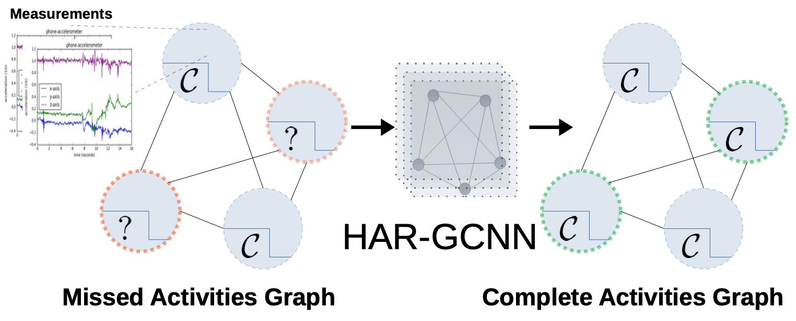

# HAR-GCNN: Deep Graph CNNs for Human Activity Recognition From Highly Unlabeled Mobile Sensor Data
### Abduallah Mohamed, Fernando Lejarza, Stephanie Cahail <br />
### Christian Claudel, Edison Thomaz
### Read full paper <a href="https://arxiv.org/abs/2203.03087">here</a>

The problem of human activity recognition from mobile sensor data applies to multiple domains, such as health monitoring, personal fitness, daily life logging, and senior care. A critical challenge for training human activity recognition models is data quality. Acquiring balanced datasets containing accurate activity labels requires humans to correctly annotate and potentially interfere with the subjects' normal activities in real-time. Despite the likelihood of incorrect annotation or lack thereof, there is often an inherent chronology to human behavior. For example, we take a shower after we exercise. This implicit chronology can be used to learn unknown labels and classify future activities. In this work, we propose HAR-GCCN, a deep graph CNN model that leverages the correlation between chronologically adjacent sensor measurements to predict the correct labels for unclassified activities that have at least one activity label. We propose a new training strategy enforcing that the model predicts the missing activity labels by leveraging the known ones. HAR-GCCN shows superior performance relative to previously used baseline methods, improving classification accuracy by about 25% and up to 68% on different datasets.<br />
<br />

<div align='center'>
</img>
</div>
<br />

# Code Intructions 
- On the first run of testing or training code, the code will save a pickled version of the processed data for faster production in the next time. 
- We used pipreqs to generate the minimum needed dependcies ro tun the code. The necessary packages are in requirements.txt, you can install it by running:
```
pip3 install -r requirements.txt
```
## Code Structure
- Dataset folder: contains the processed ExtraSensory and PAMAP dataset with a script to download the data.
- modelsExtraSensory & modelsPAMAP folders: contain our model, HAR-GCNN, and baseline models for each dataset. 
- unmaintained folder: contains the notebooks used to process the raw ExtraSensory and PAMAP datasets. This folder is unmaintained and the files within it are only for reference. 
- dataset.py: contains the HAR-GCNN dataset. 
- train.py: trains and tests our model. 
- trainbaseline.py: trains the baseline models. 
- train.sh & trainbaslines.sh: original training parameters used to train our model and the baselines. 

## Training & testing
For example to train HAR-GCNN on the ExtraSensory dataset execute the following command:
```
python3 train.py --tag test_hargcnn_extrasensory  --model hargcnn --normalization abduallahs --nodes_cnt 3 --randomseed 0 
``` 
To test the trained model add `--test` to the training command, for example:
```
python3 train.py --tag test_hargcnn_extrasensory  --model hargcnn --normalization abduallahs --nodes_cnt 3 --randomseed 0 --test
``` 
We used randomseed = {0,1,2} and reported the mean of these runs. Other examples for training settings can be found in `train.sh` and `trainbaselines.sh`.

## Ciation
```
@INPROCEEDINGS{Moha2203:HAR,
AUTHOR="Abduallah Mohamed and Fernando Lejarza and Stephanie Cahail and Christian
Claudel and Edison Thomaz",
TITLE="{HAR-GCNN:} Deep Graph {CNNs} for Human Activity Recognition From Highly
Unlabeled Mobile Sensor Data",
BOOKTITLE="CoMoRea 2022: 18th Workshop on Context and Activity Modeling and
Recognition (CoMoRea 2022)",
ADDRESS="Pisa, Italy",
MONTH=mar,
YEAR=2022,
KEYWORDS="human activity recognition; behavioral context recognition; graph
convolutional neural network; deep learning",
ABSTRACT="The problem of human activity recognition from mobile sensor data can be
applied to multiple domains such as health monitoring, personal fitness,
daily lifelogging, and senior care. A critical challenge for training human
activity recognition models is the data. Acquiring a balanced dataset
containing accurate activity labels require humans to correctly annotate
and potentially interfere with the subjects' normal activities in
real-time. Nonetheless, there is often an inherent and implicit chronology
to human behavior for example we take a shower after we exercise. This
implicit chronology can be used to learn missing labels and classify future
activities. In this work, we propose HAR-GCCN, a deep graph CNN model that
leverages the correlation between chronologically adjacent sensor
measurements to predict the correct labels for unclassified activities with
at least one activity label is precisely known. We propose a special
training strategy that enforces the model to predict the missing activities
labels by leveraging known ones. HAR-GCCN shows superior performance
relative to previously used baseline methods, improving classification
accuracy by about 25\% and up to 68\% on different datasets."
}

```
